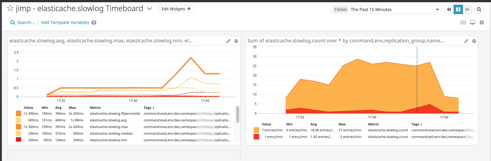

# elasticache-slowlog-to-datadog

This AWS Lambda function connects to an AWS Elasticache instance running in redis mode,
and submits slowlog entry metrics to a Datadog account. 

# lambda_function.rb

## Usage

This lambda function was built and tested with the `ruby-2.5` runtime.

Deploy the "Full zip distribution" from the [releases pages](https://github.com/scribd/elasticache-slowlog-to-datadog/releases) to AWS lambda

### Parameters

The following parameters need to be supplied to the lambda function. 

Environment Variable | Type   | Description                                                   | Required | Default
---------------------|--------|---------------------------------------------------------------|----------|---------
REDIS_HOST           | string | FQDN or URI of the elasticache redis endpoint                 | yes      | -
DATADOG_API_KEY      | string | Datadog API Key                                               | no       | -
DATADOG_APP_KEY      | string | Datadog API Key                                               | no       | -
NAMESPACE            | string | "namespace" tag to apply to Datadog metric                    | yes      | -
ENV                  | string | "env" tag to apply to the Datadog metric                      | yes      | -
METRICNAME           | string | Metric name to use                                            | no       | 'elasticache.slowlog'
SSM_PATH             | string | SSM Path where Datadog API Key and Datadog App key are stored | no       | -

*note: either DATADOG_API_KEY and DATADOG_APP_KEY must be set environment variables or passed in from SSM.*

### Terraform

See https://github.com/scribd/terraform-elasticache-slowlog-to-datadog/blob/master/main.tf for a reference
implementation in Terraform. 

# inject_slow_query.rb

This script is used to inject arbitrary slow queries into a target redis instance. 

DO NOT use this script in production environments, as it will CPU thrash the target instance.

### Parameters

Environment Variable | Type   | Description                                                   | Required | Default
---------------------|--------|---------------------------------------------------------------|----------|---------
REDIS_HOST           | string | FQDN or URI of the elasticache redis endpoint                 | yes      | -

# Requirements

To use *elasticache-slowlog-to-datadog* you need:

- An AWS account with an Elasticache instance running the `redis5.0` engine.
- A Datadog account

# Development

Releases are cut using [semantic-release](https://github.com/semantic-release/semantic-release).

Please write commit messages following [Angular commit guidelines](https://github.com/angular/angular.js/blob/master/DEVELOPERS.md#-git-commit-guidelines)
